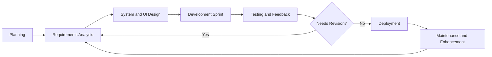
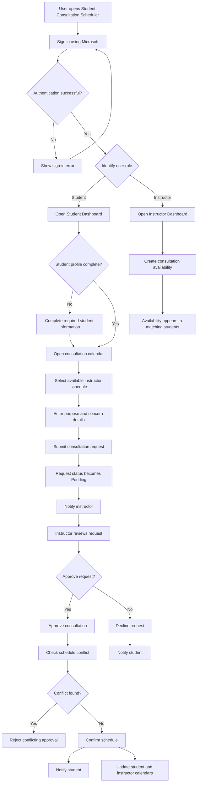
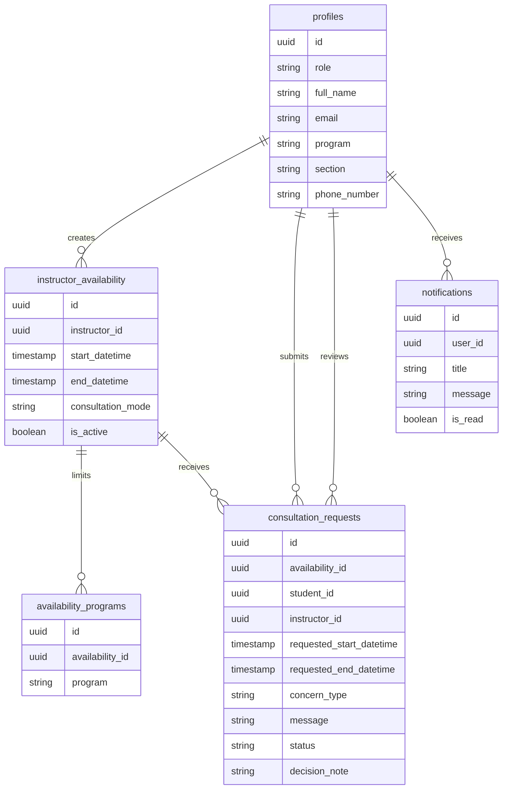

# Activity No. 2 Diagrams

## 1. SDLC Diagram

### Agile Iterative SDLC for Student Consultation Scheduler



### Short Explanation

The project will use the Agile SDLC model because the system requires continuous testing and improvement. Features such as calendar scheduling, request approval, notifications, and dashboard usability can be developed and improved through repeated iterations.

---

## 2. Use Case Diagram

```mermaid
flowchart TB
    Student((Student))
    Instructor((Instructor))
    Admin((System Administrator))

    UC1[Sign in using Microsoft account]
    UC2[Complete student profile]
    UC3[View available consultation schedules]
    UC4[Submit consultation request]
    UC5[View pending or approved request]
    UC6[Cancel request or consultation]
    UC7[Download calendar invite]
    UC8[View consultation history]

    UC9[Create availability window]
    UC10[Edit or delete availability]
    UC11[View student requests]
    UC12[Approve consultation request]
    UC13[Decline consultation request]
    UC14[View confirmed consultations]

    UC15[Manage authentication settings]
    UC16[Manage database security policies]

    Student --> UC1
    Student --> UC2
    Student --> UC3
    Student --> UC4
    Student --> UC5
    Student --> UC6
    Student --> UC7
    Student --> UC8

    Instructor --> UC1
    Instructor --> UC9
    Instructor --> UC10
    Instructor --> UC11
    Instructor --> UC12
    Instructor --> UC13
    Instructor --> UC14

    Admin --> UC15
    Admin --> UC16

    UC4 --> UC11
    UC12 --> UC5
    UC13 --> UC5
    UC12 --> UC14
```



---

## 3. System Flowchart



---

## 4. Student Dashboard Wireframe

```text
+--------------------------------------------------------------------------------+
| Fixed Topbar                                                                   |
| [Search consultations, dates, or instructors]        [Notifications] [Theme]    |
+------------+-------------------------------------------------------------------+
| Sidebar    | Student Dashboard                                                 |
| collapsed  | Welcome, Student Name                                             |
| by default |                                                                   |
|            | +------------------+ +------------------+ +------------------+      |
| [🏠]       | | Upcoming         | | Pending          | | Profile Status   |      |
| [📅]       | | Consultations    | | Requests         | | Complete         |      |
| [📋]       | +------------------+ +------------------+ +------------------+      |
| [👤]       |                                                                   |
|            | +-------------------------------------------------------------+     |
|            | | Confirmed Consultation Banner                               |     |
|            | | Date, time, instructor, format, and purpose                  |     |
|            | +-------------------------------------------------------------+     |
|            |                                                                   |
|            | +----------------------------+ +-----------------------------+     |
|            | | Consultation History       | | Guidance Card                |     |
|            | | Total requests / status    | | Booking reminders            |     |
|            | +----------------------------+ +-----------------------------+     |
+------------+-------------------------------------------------------------------+
```

---

## 5. Student Calendar Wireframe

```text
+--------------------------------------------------------------------------------+
| Topbar                                                                         |
+------------+-------------------------------------------------------------------+
| Sidebar    | Consultation Calendar                                             |
|            | Find a time to talk                                               |
|            |                                        [Today] [<] Week Range [>]  |
|            |                                                                   |
|            | +----------------------------------------------------------------+ |
|            | |        Mon        Tue        Wed        Thu        Fri          | |
|            | | 7 AM  -------------------------------------------------------   | |
|            | | 8 AM  | Available Instructor Schedule Block                 |   | |
|            | | 9 AM  | Format: F2F / Online                                  |   | |
|            | |10 AM  | Instructor Name                                      |   | |
|            | |11 AM  -------------------------------------------------------   | |
|            | |12 PM  | Pending or Approved Request Block                   |   | |
|            | | 1 PM  -------------------------------------------------------   | |
|            | +----------------------------------------------------------------+ |
|            |                                                                   |
|            | Click available schedule → Request consultation modal              |
|            | Click pending/approved request → Details modal                     |
+------------+-------------------------------------------------------------------+
```

---

## 6. Request Consultation Modal Wireframe

```text
+----------------------------------------------------------+
| Request Consultation                                [X]  |
+----------------------------------------------------------+
| Instructor: Instructor Name                              |
| Format: F2F / Online / Both                              |
| Available Time: 8:00 AM - 3:00 PM                        |
|                                                          |
| Preferred Start Time                                    |
| [ 10:00 AM v ]                                           |
|                                                          |
| Preferred End Time                                      |
| [ 10:30 AM v ]                                           |
|                                                          |
| Purpose                                                  |
| [Research] [Grades] [Projects] [Others]                  |
|                                                          |
| Concern Details                                          |
| [ Type consultation concern here...                  ]   |
|                                                          |
|                         [Cancel] [Send Request]          |
+----------------------------------------------------------+
```

---

## 7. Student Consultation Details Modal Wireframe

```text
+----------------------------------------------------------+
| Consultation Details                         [Approved] [X] |
+----------------------------------------------------------+
| Scheduled For                                            |
| Date: Monday, August 10, 2026                            |
| Time: 10:00 AM - 10:30 AM                                |
|                                                          |
| Instructor: Instructor Name                              |
| Instructor Email: instructor@ms.bulsu.edu.ph             |
| Format: F2F / Online                                     |
| Concern: Research                                        |
|                                                          |
| Concern Details                                          |
| [ Student concern message ]                              |
|                                                          |
| Calendar Invite                                          |
| [Download invite]                                        |
|                                                          |
| Rules                                                    |
| - Pending requests can be edited or cancelled.           |
| - Approved consultations can only be cancelled before    |
|   the 24-hour cutoff.                                    |
+----------------------------------------------------------+
```

---

## 8. Instructor Dashboard Wireframe

```text
+--------------------------------------------------------------------------------+
| Fixed Topbar                                                                   |
| [Search requests, students, dates, or concerns]      [Notifications] [Theme]    |
+------------+-------------------------------------------------------------------+
| Sidebar    | Instructor Dashboard                                              |
| collapsed  | Welcome, Instructor Name                                          |
| by default |                                                                   |
|            | +------------------+ +------------------+ +------------------+      |
| [🏠]       | | Active Windows   | | Pending Requests | | Approved Slots   |      |
| [📅]       | +------------------+ +------------------+ +------------------+      |
| [📋]       |                                                                   |
| [👤]       | +----------------------------+ +-----------------------------+     |
|            | | Consultation Requests      | | Availability Planning       |     |
|            | | Open requests page         | | Publish windows carefully   |     |
|            | +----------------------------+ +-----------------------------+     |
+------------+-------------------------------------------------------------------+
```

---

## 9. Instructor Calendar Wireframe

```text
+--------------------------------------------------------------------------------+
| Topbar                                                                         |
+------------+-------------------------------------------------------------------+
| Sidebar    | Manage Consultation Windows                                       |
|            | Create availability, edit open windows, review confirmed bookings |
|            |                                        [Today] [Week v] [<] [>]    |
|            |                                                                   |
|            | +----------------------------------------------------------------+ |
|            | |        Mon        Tue        Wed        Thu        Fri          | |
|            | | 7 AM  -------------------------------------------------------   | |
|            | | 8 AM  | Availability Block                                  |   | |
|            | | 9 AM  | Format: Online / F2F                                 |   | |
|            | |10 AM  | Program scope hidden from student display            |   | |
|            | |11 AM  -------------------------------------------------------   | |
|            | |12 PM  | Approved Consultation Block                          |   | |
|            | | 1 PM  -------------------------------------------------------   | |
|            | +----------------------------------------------------------------+ |
|            |                                                                   |
|            | Drag within one day → Create availability modal                    |
|            | Click availability → Edit/delete availability                      |
|            | Click approved booking → View/cancel/reschedule details            |
+------------+-------------------------------------------------------------------+
```

---

## 10. Instructor Requests Page Wireframe

```text
+--------------------------------------------------------------------------------+
| Topbar                                                                         |
+------------+-------------------------------------------------------------------+
| Sidebar    | Requests                                                          |
|            | Review consultation requests                                      |
|            |                                                                   |
|            | +-----------------------------+ +-----------------------------+   |
|            | | Pending Requests            | | Reviewed Requests           |   |
|            | | Search/filter/pagination    | | Approved/Declined records   |   |
|            | +-----------------------------+ +-----------------------------+   |
|            |                                                                   |
|            | Pending Request Card                                               |
|            | +--------------------------------------------------------------+   |
|            | | Student Name                                                   |   |
|            | | Program / Section                                              |   |
|            | | Requested Date and Time                                        |   |
|            | | Purpose and Concern Details                                    |   |
|            | |                         [Decline] [Approve]                   |   |
|            | +--------------------------------------------------------------+   |
+------------+-------------------------------------------------------------------+
```

---

## 11. Database Relationship Diagram



