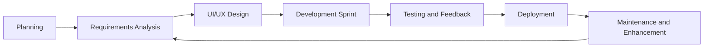
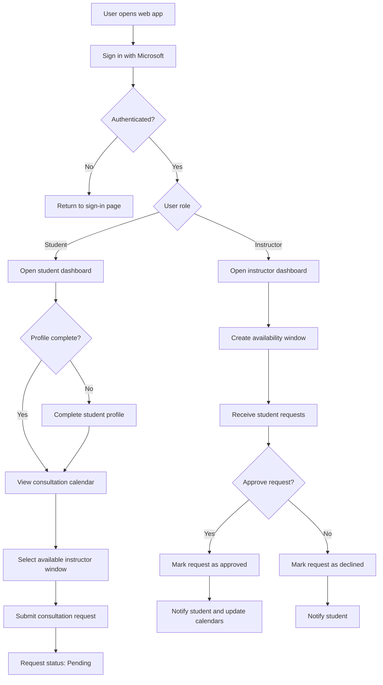

# Activity No. 2 – From Idea to Specification: Defining the Software Requirements

## Project Title

Student Consultation Scheduler

## Project Overview

The Student Consultation Scheduler is a web-based appointment management system for Bulacan State University graduate students and instructors. It allows students to request academic consultation appointments based on instructor availability, while instructors can publish consultation windows, review requests, and approve or decline appointments.

The system is designed to reduce manual coordination through email or chat by providing a centralized calendar, request tracking, role-based dashboards, notifications, and consultation history.

---

## 1. SDLC Diagram and Rationale

### Selected SDLC Model: Agile Iterative Model

The Agile Iterative Model is appropriate because the system has multiple user-facing features that benefit from continuous testing and improvement, especially calendar interaction, appointment approval, notifications, authentication, and dashboard usability.



### Rationale

The project is best developed using Agile because:

- The system has two primary user groups: students and instructors.
- Calendar and scheduling behavior must be tested repeatedly for usability.
- Requirements may change as users discover better workflows.
- Features can be released in phases, such as authentication, profile setup, availability management, request approval, and notifications.
- Feedback from students and instructors can improve the system before final deployment.

### Development Phases

| Phase | Description | Output |
|---|---|---|
| Planning | Identify the problem and users | Project scope and objectives |
| Requirements Analysis | Define user needs and system behavior | Functional and non-functional requirements |
| Design | Create database model, workflows, and UI wireframes | Diagrams and interface mockups |
| Development | Build the application using Next.js, Supabase, and Tailwind CSS | Working system modules |
| Testing | Validate authentication, scheduling, approvals, and notifications | Test results and fixes |
| Deployment | Host the system through Vercel and Supabase | Online working application |
| Maintenance | Improve performance, security, and usability | Updated versions |

---

## 2. Requirements Analysis

### Problem Statement

Students often need consultations for research, grades, projects, and other academic concerns. However, consultation scheduling is usually handled manually through messages, emails, or informal arrangements. This can cause missed appointments, unclear availability, duplicated bookings, and difficulty tracking approved or declined requests.

### Proposed Solution

The proposed system provides a centralized consultation scheduler where:

- Students can view available instructor consultation windows.
- Students can submit focused appointment requests.
- Instructors can publish availability based on date, time, consultation format, and program scope.
- Instructors can approve or decline student requests.
- Approved schedules are reflected on student and instructor calendars.
- Users receive notifications for request updates.
- Consultation records are stored for tracking and history.

### Stakeholders

| Stakeholder | Role |
|---|---|
| Students | Request consultation appointments and track request status |
| Instructors | Publish availability and approve or decline requests |
| System Administrator | Manages database, authentication, and deployment settings |
| Institution | Benefits from organized consultation records and improved academic support |

### User Roles

| Role | Access |
|---|---|
| Student | Student dashboard, consultation calendar, request modal, history, profile |
| Instructor | Instructor dashboard, availability calendar, request review page, profile |

### Functional Requirements

| ID | Requirement | User |
|---|---|---|
| FR-01 | The system shall allow users to sign in using Microsoft authentication. | Student, Instructor |
| FR-02 | The system shall restrict student access to institutional email accounts. | Student |
| FR-03 | The system shall create or retrieve user profiles after login. | Student, Instructor |
| FR-04 | The system shall allow students to complete required profile information. | Student |
| FR-05 | The system shall allow instructors to create consultation availability windows. | Instructor |
| FR-06 | The system shall allow instructors to set consultation mode: F2F, Online, or Both. | Instructor |
| FR-07 | The system shall allow instructors to limit availability by program. | Instructor |
| FR-08 | The system shall show only matching availability to students based on program. | Student |
| FR-09 | The system shall allow students to request a consultation within available time windows. | Student |
| FR-10 | The system shall require concern type and concern details when requesting. | Student |
| FR-11 | The system shall allow instructors to approve or decline requests. | Instructor |
| FR-12 | The system shall prevent overlapping approved consultation schedules. | System |
| FR-13 | The system shall notify students when requests are approved, declined, or cancelled. | Student |
| FR-14 | The system shall notify instructors when new requests are submitted. | Instructor |
| FR-15 | The system shall show consultation history with search support. | Student, Instructor |
| FR-16 | The system shall allow calendar invite download for approved consultations. | Student |
| FR-17 | The system shall allow cancellation only before the cutoff period. | Student |
| FR-18 | The system shall update dashboards in near real time. | Student, Instructor |

### Non-Functional Requirements

| ID | Requirement |
|---|---|
| NFR-01 | The system shall be responsive for desktop, tablet, and mobile screens. |
| NFR-02 | The system shall use role-based access control to prevent unauthorized access. |
| NFR-03 | The system shall protect database records using Supabase Row Level Security. |
| NFR-04 | The system shall provide readable dark mode and light mode interfaces. |
| NFR-05 | The system shall provide clear feedback using toast notifications. |
| NFR-06 | The system shall load dashboards efficiently without unnecessary visual weight. |
| NFR-07 | The system shall prevent duplicate or conflicting approved bookings. |
| NFR-08 | The system shall maintain consultation records for accountability. |

---

## 3. Mini Software Requirements Specification

### 3.1 Purpose

This document defines the software requirements for the Student Consultation Scheduler. It describes the system scope, users, features, workflows, and interface expectations.

### 3.2 Scope

The system covers consultation scheduling between students and instructors. It includes authentication, student profile setup, instructor availability management, consultation request submission, request approval, notifications, calendar display, and consultation history.

### 3.3 Product Perspective

The application is a web-based system built with:

- Next.js for the frontend and routing
- Supabase for authentication, database, realtime updates, and security rules
- Tailwind CSS for responsive UI styling
- Vercel for deployment

### 3.4 Product Functions

The system provides the following core functions:

1. Microsoft-based sign-in.
2. Student and instructor role detection.
3. Student profile completion.
4. Instructor availability publishing.
5. Program-scoped consultation windows.
6. Student consultation request submission.
7. Instructor request approval or rejection.
8. Automatic conflict handling for overlapping requests.
9. Realtime updates across dashboards.
10. Notification badges and status updates.
11. Consultation history and search.
12. Calendar invite download for approved schedules.

### 3.5 User Classes

| User Class | Description |
|---|---|
| Student | Requests consultations and tracks status |
| Instructor | Publishes availability and reviews student requests |
| Administrator | Configures authentication, database policies, and deployment |

### 3.6 Operating Environment

| Component | Environment |
|---|---|
| Client | Modern web browser |
| Frontend | Next.js application |
| Backend | Supabase services |
| Database | PostgreSQL through Supabase |
| Hosting | Vercel |

### 3.7 Constraints

- Student accounts must use the approved institutional domain.
- Users must be authenticated before accessing dashboards.
- Students must complete required profile information before requesting consultations.
- Approved appointments must not overlap for the same instructor.
- Cancellation may be restricted within one day before the consultation.

### 3.8 Assumptions and Dependencies

- Users have valid institutional Microsoft accounts.
- Supabase authentication and database services are available.
- Internet access is required.
- Instructor availability must be encoded before students can request consultations.

---

## 4. Use Case Diagram

```mermaid
flowchart TB
    Student((Student))
    Instructor((Instructor))
    Admin((Administrator))

    UC1[Sign in]
    UC2[Complete profile]
    UC3[View available consultation windows]
    UC4[Submit consultation request]
    UC5[View request status]
    UC6[View consultation history]
    UC7[Download calendar invite]

    UC8[Create availability]
    UC9[Edit or delete availability]
    UC10[Review requests]
    UC11[Approve request]
    UC12[Decline request]
    UC13[View confirmed consultations]

    UC14[Manage authentication settings]
    UC15[Manage database security policies]

    Student --> UC1
    Student --> UC2
    Student --> UC3
    Student --> UC4
    Student --> UC5
    Student --> UC6
    Student --> UC7

    Instructor --> UC1
    Instructor --> UC8
    Instructor --> UC9
    Instructor --> UC10
    Instructor --> UC11
    Instructor --> UC12
    Instructor --> UC13

    Admin --> UC14
    Admin --> UC15
```



---

## 5. System Flowchart



---

## 6. Initial UI Wireframe

### 6.1 Landing Page

```text
+--------------------------------------------------------------+
| Consultation Scheduler                  [Theme] [Sign in]     |
+--------------------------------------------------------------+
|                                                              |
| Coordinate academic consultations with clarity.               |
|                                                              |
| A structured scheduler for students and instructors.          |
|                                                              |
| [Sign in with Microsoft]   [View workflow]                    |
|                                                              |
+--------------------------------------------------------------+
| Features                                                     |
| - Availability windows                                       |
| - Focused requests                                           |
| - Approval workflow                                          |
| - Secure records                                             |
+--------------------------------------------------------------+
```

### 6.2 Student Dashboard

```text
+---------+----------------------------------------------------+
| Sidebar | Topbar: Search, Notifications, Theme, Logout        |
|         +----------------------------------------------------+
| Icons   | Student Dashboard                                  |
|         | Welcome, Student Name                              |
|         |                                                    |
|         | [Upcoming] [Pending] [Profile Status]               |
|         |                                                    |
|         | Confirmed Consultation Banner                       |
|         |                                                    |
|         | Consultation History Summary                        |
+---------+----------------------------------------------------+
```

### 6.3 Student Calendar

```text
+---------+----------------------------------------------------+
| Sidebar | Find a time to talk                                |
|         | [Download Invite] [Today] [Week Navigation]         |
|         +----------------------------------------------------+
|         | Calendar grid                                      |
|         |                                                    |
|         | [Instructor availability block]                     |
|         | [Pending request block]                             |
|         | [Approved consultation block]                       |
+---------+----------------------------------------------------+
```

### 6.4 Instructor Dashboard

```text
+---------+----------------------------------------------------+
| Sidebar | Topbar: Search, Notifications, Theme, Logout        |
|         +----------------------------------------------------+
| Icons   | Instructor Dashboard                               |
|         | Welcome, Instructor Name                            |
|         |                                                    |
|         | [Active Windows] [Pending Requests] [Approved Slots] |
|         |                                                    |
|         | Request Review Summary                              |
|         | Availability Planning Summary                       |
+---------+----------------------------------------------------+
```

### 6.5 Instructor Calendar

```text
+---------+----------------------------------------------------+
| Sidebar | Manage consultation windows                         |
|         | [Today] [Week/Month] [Navigation]                   |
|         +----------------------------------------------------+
|         | Calendar grid                                      |
|         |                                                    |
|         | Drag time range to create availability              |
|         | Click availability to edit/delete                   |
|         | Click approved consultation to view details         |
+---------+----------------------------------------------------+
```

---

## 7. Database and Security Summary

### Main Data Entities

| Entity | Description |
|---|---|
| profiles | Stores user role, name, program, section, and contact details |
| instructor_availability | Stores instructor consultation windows |
| availability_programs | Stores which programs can see an availability window |
| consultation_requests | Stores student requests and approval status |
| notifications | Stores user-facing notification records |

### Security Measures

- Authentication is handled through Supabase Auth.
- Students and instructors are routed based on assigned roles.
- Student email domain restrictions are enforced.
- Supabase Row Level Security should protect records per user role.
- Public browser code must not expose service role keys.
- Scheduling conflict checks prevent overlapping approved consultations.
- Users can only access dashboard pages after authentication.

---

## 8. Five-Slide Presentation Outline

### Slide 1: Project Overview

**Title:** Student Consultation Scheduler  
**Content:**

- Web-based consultation scheduling system
- Designed for BulSU students and instructors
- Supports availability, requests, approvals, notifications, and history
- Reduces manual coordination through chat or email

### Slide 2: SDLC Model and Rationale

**Title:** Agile Iterative Development  
**Content:**

- Agile is used because the system requires continuous feedback
- Calendar UX and approval workflow need repeated testing
- Features can be developed in phases
- Supports improvement based on student and instructor feedback

### Slide 3: Requirements Analysis

**Title:** Core Requirements  
**Content:**

- Students can view available consultation windows
- Students can submit appointment requests
- Instructors can publish availability
- Instructors can approve or decline requests
- System prevents overlapping approved bookings
- Dashboards update in near real time

### Slide 4: System Flow and Use Cases

**Title:** How the System Works  
**Content:**

- Student signs in and completes profile
- Instructor creates availability
- Student selects a time and submits request
- Instructor reviews request
- Approved schedule appears on both calendars
- Notification and history records are updated

### Slide 5: Initial UI and Security

**Title:** Interface and Protection  
**Content:**

- Responsive dashboard with collapsible sidebar
- Calendar-based scheduling interface
- Separate request review page for instructors
- Role-based routing
- Supabase Row Level Security
- Secure authentication and protected records

---

## 9. Group Meeting Recording Requirement

As part of the activity requirement, the group should record the meeting while completing the output. The recording may include:

- Discussion of the selected project idea
- Identification of users and requirements
- Agreement on the SDLC model
- Drafting of diagrams and wireframes
- Review of the final mini-SRS and presentation outline

Suggested recording proof:

- Video meeting recording
- Screenshot of meeting attendees
- Short meeting minutes
- File link or storage location of the recording

